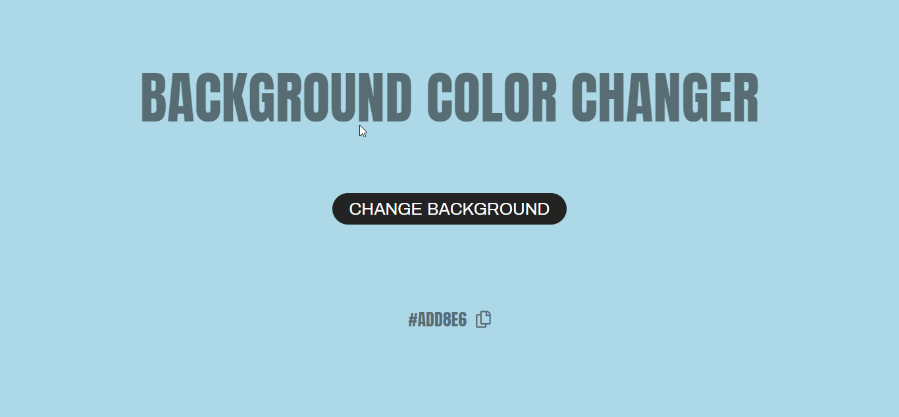

<head>
  <link rel="preconnect" href="https://fonts.gstatic.com">
  <link href="https://fonts.googleapis.com/css2?family=Anton&display=swap" rel="stylesheet">
</head>

<h1 align="center" style="font-family: Anton; color: rgb(0, 0, 0, 0.5); font-size: 2.6rem; text-transform: uppercase;">
 
  Background Color Changer
 
</h1>

  Um site simples que troca aleatoriamente a cor de plano de fundo.

  

  

  

---

## 🚀 [Demonstração](https://gmatthewsfeuer.github.io/BackgroundColorChanger/)

## ❔ Sobre o projeto

Este projeto tem como finalidade a aplicação dos conhecimentos de JavaScript para mudar aleatoriamente as cores de plano de fundo da página de forma simples,além de ter opção de visualizar a cor em forma hexadecimal e copiar para a sua área de transferência pronto para uso.

## 😄 Agradeço a sua atenção!

### License

This project is licensed under the MIT License - see the [LICENSE](https://opensource.org/licenses/MIT) page for details.
